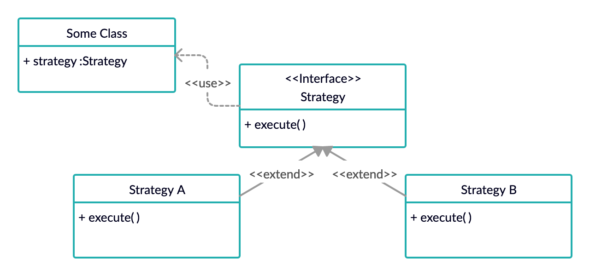

# Design Pattern from Head First Design Pattern Book

- Language used : java

## Design Patterns

### 1. Strategy Pattern
> The Strategy Pattern defines a family of algorithms, ecapsulates each one, and makes them interchangable. Strategy lets the algorithm vary independetly from clients that use it.

### 2. Observer Pattern
> The Observer Pattern defines a one-to-many dependency between objects so that when one object changes state, all of its dependents are notified and update automatically.

### 3. Decorator Pattern
> The Decorator Pattern attaches additional responsibilities to an object dynamically. Decorators provide a flexible alternative to subclassing for extending functionality.

## Design Principles

1. Identify the aspects of your application that vary and separate them from what stays the same.
	> Take the parts that vary and encapsulate them, so that later you can alter or extend the parts that vary without affecting those that don't.

2. Program to an interface, not an implementation.
	> The point is to exploit polymorphism by programming to a supertype so that the actual runtime object isn’t locked into the code. We delegate the behaviors insted of defining it inside its class.

3. Favor composition over inheritance.
	> HAS-A can be better then IS-A. It will let you change behaviour at runtime as long as the object you're composing with implements the correct behaviour interface.

4. Stive for loosely coupled designs between objects that interact.
	> Loosely coupled designs allow us to build flexible OO Systems that can handle change because they minimize the interdependency between objects.

5. The Open-Closed Principle.
	> Classes should be open for extension, but closed for modification.

